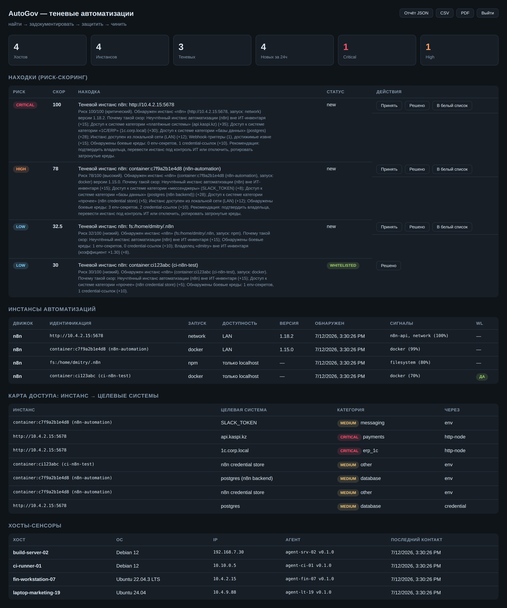
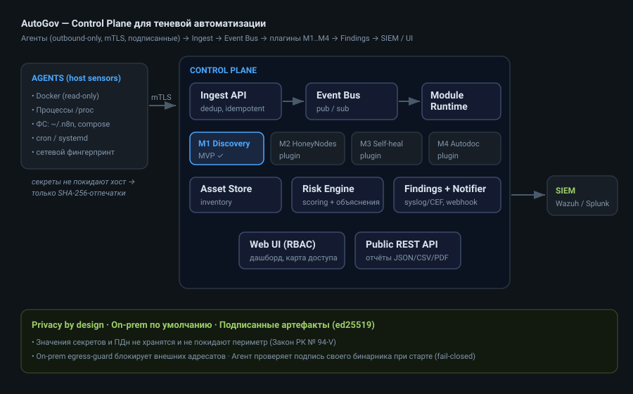

<div align="center">

# 🛡️ AutoGov

### Control plane for **shadow automation** — find the unmanaged n8n instances leaking access to your production systems

Employees spin up **self-hosted n8n** in Docker on laptops and servers, wire in
live credentials to 1C / CRM / databases / payment APIs, and run workflows
**without security's knowledge**. Existing Shadow-IT tools see SaaS/OAuth — they
**do not see locally-deployed automations**. AutoGov does.

**find → document → protect → heal**

[](https://github.com/oleg-vdv/AutoGov/actions/workflows/ci.yml)
[](LICENSE)
[](COMMERCIAL.md)
[](https://go.dev)


[**Quick start**](#-quick-start-2-minutes) ·
[Usage guide](docs/USAGE.md) ·
[Architecture](docs/ARCHITECTURE.md) ·
[Go-to-market](docs/GO_TO_MARKET.md) ·
[Русская версия](docs/README.ru.md)

</div>

---

<div align="center">

<br/><sub>The dashboard (UI available in English and Russian): risk-scored findings with plain-language explanations, the “instance → credentials → target systems” access map, and sensor inventory.</sub>
</div>

---

## Why AutoGov

- 🔍 **Sees what others miss.** SaaS-discovery tools (Defender for Cloud Apps,
  Nudge, Auvik) find OAuth apps. EDRs inventory processes. Neither maps a
  shadow `localhost:5678` n8n instance to the **1C and payment systems it can
  reach**. AutoGov builds exactly that graph.
- 🧭 **Access map, not just an inventory.** For every unmanaged instance:
  *which credentials → which production systems*, with a numeric risk score, a
  Critical/High/Medium/Low category, and a **human-readable “why”** for the
  CISO report.
- 🔒 **Privacy by design.** The agent records the **fact** a secret exists — its
  name, type and target — but **never reads or transmits the value** (only a
  SHA-256 fingerprint). No field in the data model can hold a secret or PII.
- 🇰🇿 **On-prem / in-country by default.** In on-prem mode all external egress
  (including external LLMs) is **refused** — no cross-border transfer
  (Kazakhstan Law No. 94-V). Fully air-gappable: no external dependencies.
- 🧩 **Platform, not a monolith.** A universal core (agent + control plane +
  data model + event bus); M1 Discovery is the first vertical slice, M2–M4 plug
  in as modules **without touching the core** — proven by tests.
- 🔐 **Secure by construction.** Outbound-only agent (no listening ports),
  mTLS, read-only Docker socket, RBAC + audit log, and **signed release
  artifacts** the agent verifies at startup (fail-closed).

<div align="center">

</div>

## How detection works (multi-signal, low false positives)

The agent detects n8n by a **combination** of signals — never one — to keep
false positives low:

| Signal | What it inspects |
|---|---|
| 🐳 Docker | `n8nio/n8n` images, port 5678, `N8N_*` env, linked postgres/redis (queue mode) — via **read-only** socket |
| ⚙️ Processes | Node.js n8n signatures, Python runners/schedulers in `/proc` |
| 🌐 Network | HTTP fingerprint: `/rest` + `/api/v1/docs` + `/healthz` uniquely identify n8n |
| 📁 Filesystem | `~/.n8n`, `docker-compose.yml` with n8n, `.env` referencing `N8N_ENCRYPTION_KEY` |
| ⏰ Schedulers | `cron` entries and `systemd` timers launching automation runners |

Legitimate (IT-sanctioned) instances go on a **whitelist** so the product
doesn't cry wolf on CI/CD containers — a first-release requirement, not a
“later”.

## 🚀 Quick start (2 minutes)

Requires Docker with the Compose plugin.

```bash
git clone https://github.com/oleg-vdv/AutoGov.git
cd AutoGov/deploy
docker compose up --build
```

This brings up the control plane, an intentionally **shadow** n8n instance, and
an agent. Open **http://localhost:8443**, log in with token `dev-admin`. Within
~30 s the agent discovers the n8n instance, builds the access map, and shows
risk-scored findings.

> Demo uses HTTP and dev tokens — local evaluation only. For a pilot, enable
> TLS/mTLS, replace tokens, and keep `mode: onprem`. See the
> [usage guide](docs/USAGE.md).

### Build from source

```bash
make build   # → bin/agent, bin/controlplane, bin/autogov-sign
make test
```

Pure Go standard library — **no external dependencies** (auditable agent,
air-gapped installs).

## Components

| Path | Purpose |
|---|---|
| `cmd/controlplane` | Central server: ingest, API, UI, modules |
| `cmd/agent` | Host sensor (outbound-only), collectors + disk spool |
| `cmd/autogov-sign` | Release signing (ed25519) + integrity verification |
| `internal/modules` | Module Runtime + `discovery` (M1) and M2–M4 plugin stubs |
| `internal/risk` | Risk scoring with local (no-LLM) explanations |
| `internal/agent/sanitize` | Privacy guard: secret values never leave the host |
| `internal/notify` | Notifiers (syslog/CEF, webhook, email) + on-prem egress guard |

## Roadmap

- [x] **Stage 1 — M1 Discovery for n8n (MVP, pilot-ready)**
- [ ] Stage 2 — generic automations (Make agents, scripts), Windows agent, more SIEM
- [ ] Stage 3 — M2 HoneyNodes (contract + stub already in place)
- [ ] Stage 4 — M3 Self-healing / M4 Autodoc (contracts + stubs already in place)

## Business & positioning

AutoGov follows an **open-core** model: the agent and platform core are open
(auditability removes the adoption barrier for a privileged sensor); paid
modules M2–M4 are the up-sell. Full ICP, value-by-role, competitive moat and a
90-day validation plan are in **[docs/GO_TO_MARKET.md](docs/GO_TO_MARKET.md)**.

## Contributing & security

See [CONTRIBUTING.md](CONTRIBUTING.md) and [SECURITY.md](SECURITY.md). The
privacy invariant is non-negotiable: a change that makes the agent transmit
secret values will not be merged.

## License

**AGPL-3.0-or-later** — see [LICENSE](LICENSE).

- Scan your own estate, change the code, run it wherever you like — freely.
- **Ship it inside a product or a service you sell** — an MSSP offering, a
  security platform, a hosted scanner — and the AGPL obliges you to release the
  source of that product under the same terms.
- If that does not work for you, a **commercial licence** removes the
  obligation: see [COMMERCIAL.md](COMMERCIAL.md).

Releases up to and including the last Apache-2.0 tag stay under Apache-2.0 —
nothing already published is taken back. The change applies from here onward,
and the copyright is held by a single author.

<div align="center"><sub>Built to give security teams a control plane for the shadow-automation boom. Not affiliated with n8n GmbH — AutoGov inspects instances you already run, it does not host n8n.</sub></div>
